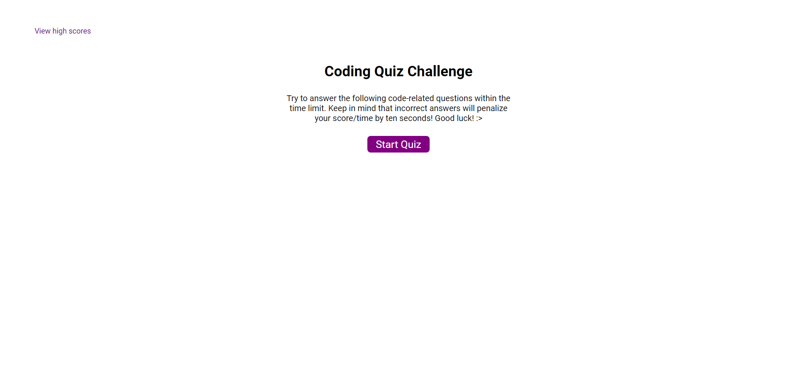
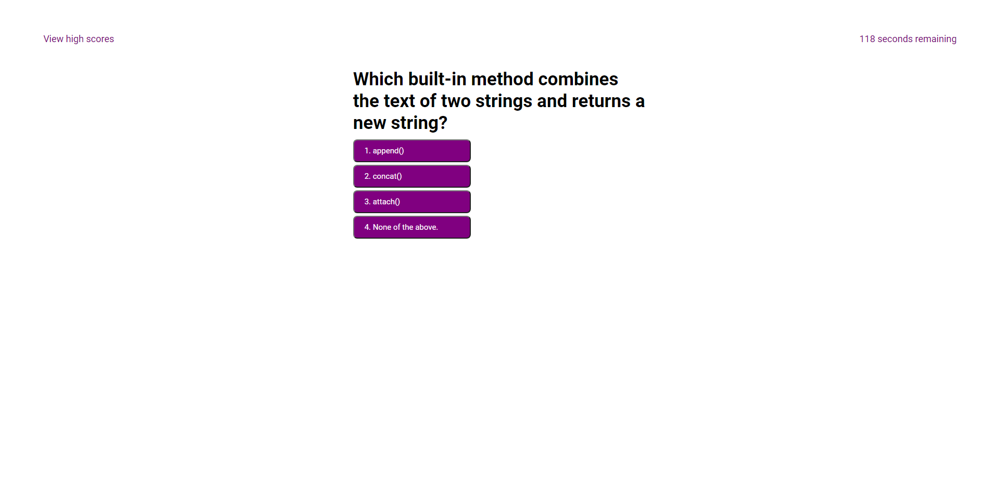
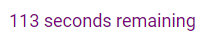

# Code Quiz

## Description

A timed coding quiz with multiple-choice questions featuring a dynamically updated HTML and CSS powered by JavaScript.

**Link to Deployed Application:** [https://aldrinburgos18.github.io/Code-Quiz-v2/](https://aldrinburgos18.github.io/Code-Quiz-v2/)

## Table of Contents

- [Installation](#installation)
- [Screenshots](#screenshots)
- [Contributing](#contributing)
- [Questions](#questions)
- [License](#license)
- [Technologies Used](#technologies-used)

## Installation

No installation needed.

## Screenshots

This is what the landing page looks like:

When a user clicks "Start Quiz":  

Timer starts counting down as soon as the quiz starts  

High scores are then shown after the quiz with an option to restart:

## Contributing

When contributing to this repository, please first discuss the change you wish to make via issue, email, or any other method with the owners of this repository before making a change.

## Questions

If you have any additional questions, please feel free to contact me at:  
E-mail: burgos.aldrin@gmail.com  
Github: [aldrinburgos18](https://github.com/aldrinburgos18)

## License

  
A short and simple permissive license with conditions only requiring preservation of copyright and license notices. Licensed works, modifications, and larger works may be distributed under different terms and without source code.  
_[More Information about this license...](https://opensource.org/licenses/MIT)_

## Technologies Used

-HTML  
-CSS  
-Javascript
